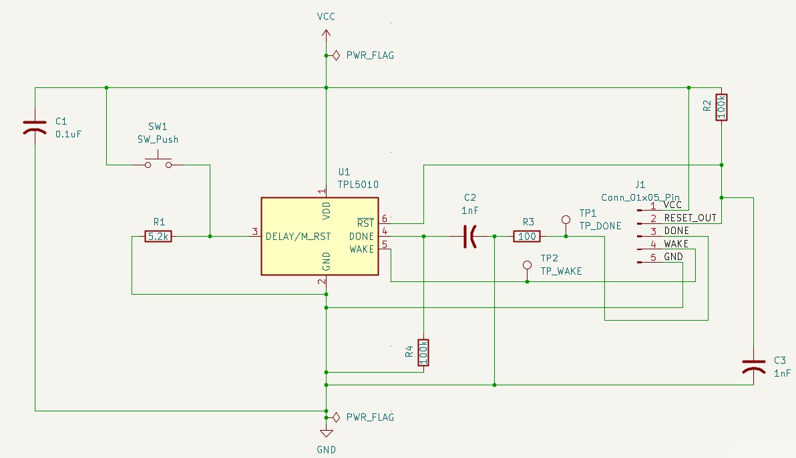
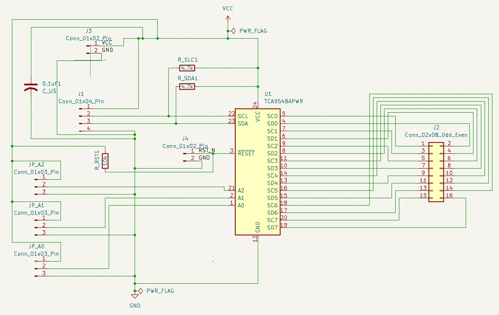
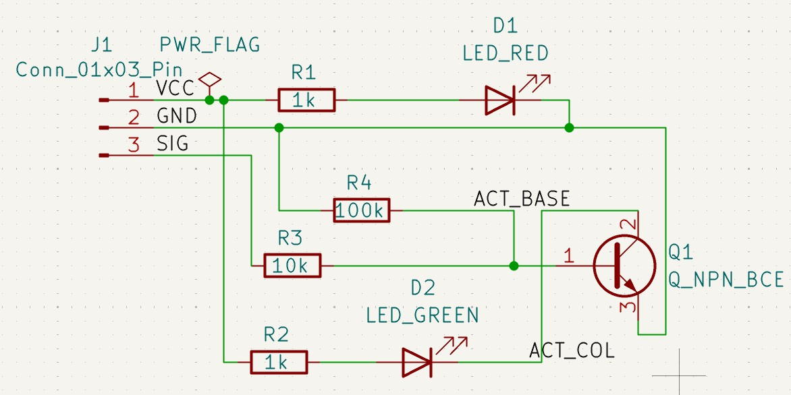

# KiCad PCB Projects

## watchdog_tpl5010
Low-power TPL5010 watchdog timer that wakes a host and asserts reset if the DONE pulse is missing.

## tca9548a_breakout
TCA9548A 8-channel I2C switch/multiplexer breakout to route a single I2C master to one of eight downstream buses.

## two-led-status
Two-LED status indicator with a single signal input that selects red or green via an NPN switch.

